Name: Manoj Kumar Galla
# Binary Classification of Sclerotic and Non-Sclerotic Glomeruli

# About the task
This project aims to develop a machine learning model to classify globally sclerotic and non-sclerotic glomeruli from kidney biopsy images. The task involves handling an imbalanced dataset, applying preprocessing techniques, training a convolutional neural network (CNN), and evaluating the model's performance on unseen data.

# Dataset Overview
The given dataset of glomeruli patches is highly imbalanced, with Non globally sclerotic glomeruli images (4074) more than globally sclerotic glomeruli images (1054).  

 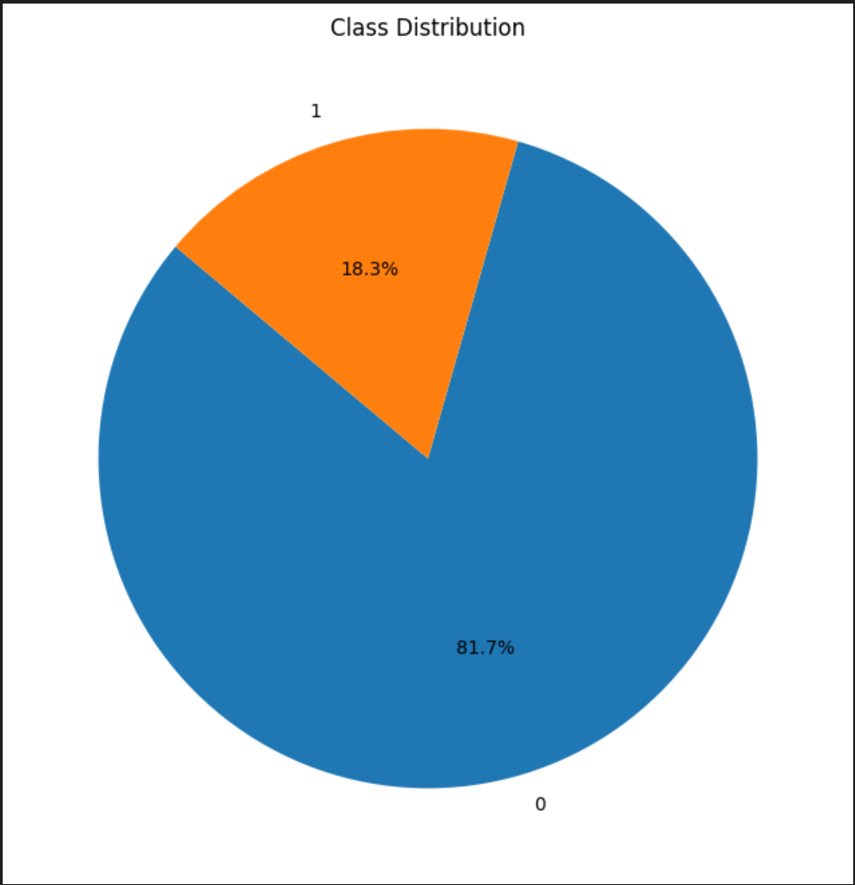 

# ML Pipeline

# Initial Approach
### Data Loading:

1. Images and their corresponding labels are loaded from the provided dataset.
2. Images are resized to a standard dimension (224x224) to ensure consistency.

### Handling Imbalance:
#### 1. SMOTE (Synthetic Minority Over-sampling Technique)
The dataset is imbalanced, with more non-sclerotic glomeruli images(81.7%) than sclerotic ones(18.3%).
SMOTE (Synthetic Minority Over-sampling Technique) is applied to the minority class (sclerotic glomeruli) to generate synthetic samples and partially balance the dataset (number of minority samples to become half the number of majority samples).

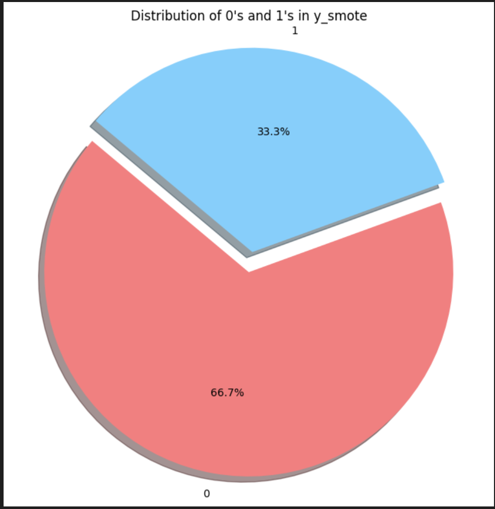

Here are a few images that are synthetically generated using SMOTE technique:

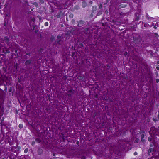  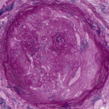  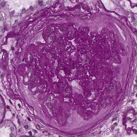

#### 2. Data Augmentation
Further balancing is achieved by augmenting the minority class images using techniques like rotation, width/height shift, shear, zoom, and horizontal flip.

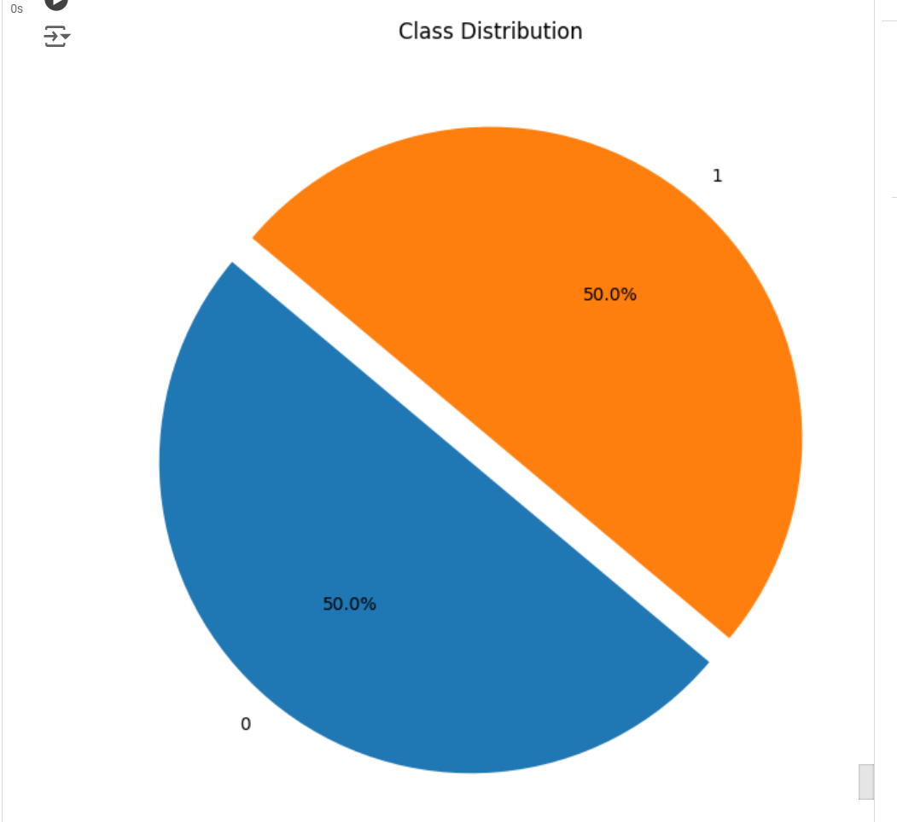

Here are a few images that are generated using data augmentation:

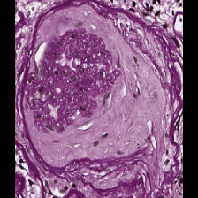  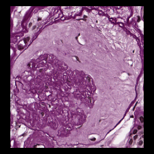  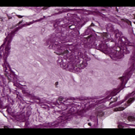

### Dividing the dataset - train, test, val
In the initial approach, the training, validation and test datasets are divided 'after' the oversampling of minority samples. 
First, 15% of the oversampled distributions are stratifically split to form test dataset so that the uniformity of the distribution is maintained. After this , the remaining data is then split into train and validation to train the model.

The test dataset contains 1410 images with 705 images from each class.

## MODEL DEVELOPMENT

### CNN Architecture:

1. I initially used a custom CNN with the Sequential API, but it struggled with deeper architectures due to vanishing gradients, leading to suboptimal performance. ResNet-50, with its residual connections, effectively addresses this issue, enabling deeper network training and achieving better accuracy on complex image classification tasks.
2. The architecture includes multiple convolutional layers followed by max-pooling layers, a flattening layer, and fully connected dense layers with dropout for regularization.

### Training:

1. The model is trained using the train and validation datasets that are obtained from the data preprocessing stage of the ML pipeline.
2. Observing each train cycle, I noticed the unusualities trends in the train and val accuracy. Based on these, I picked those hyperparameters that played role in the unusual trends and tuned them manually to observe the results. This way, I could address the issues in the training.

## Evaluation:
### Metrics:

1. The model is evaluated using accuracy, precision, recall and F1-score.
2. These metrics help in understanding the model's performance in classifying sclerotic and non-sclerotic glomeruli accurately.
3. In our dataset, we consider globally sclerotic glomeruli as the positive class with label - 1 and the non globally sclerotic glomeruli images with the label - 0. The focus lies on the recall score primarily, followed by precision because the positive dataset is the minority dataset and major experimentation was done on this class images. Hence, it is important for the model to generalize this class images on unseen data properly.

## Results:

### Accuracy and Loss
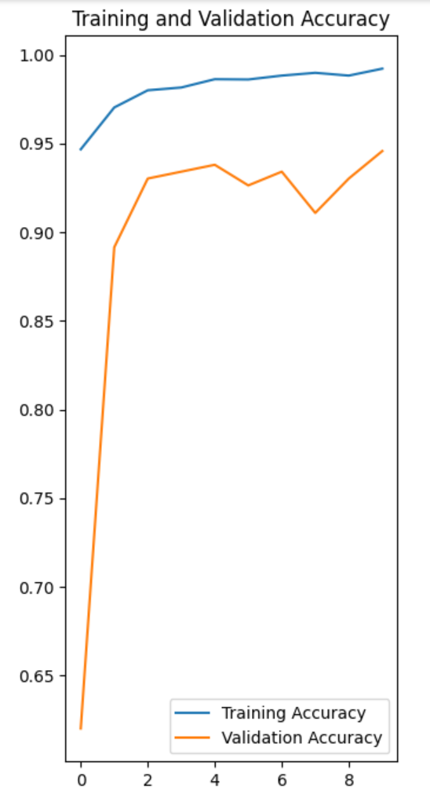       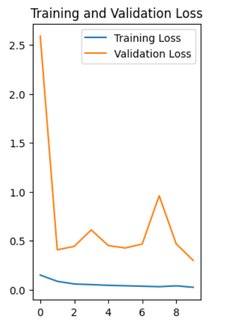

### Testing 
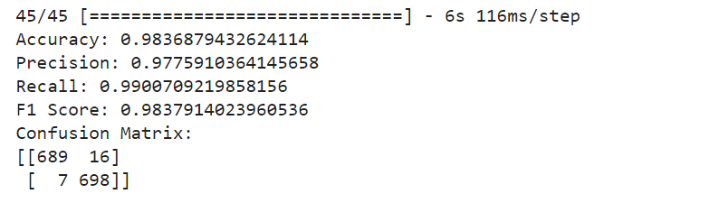

# Observations, Concerns and Countermeasures about Initial approach
## Concerns 
1. The Validation accuracy plot being above the training accuracy is unusual - Dr Ahmed Naglah.
2. Early dropout can be implemented when there are downward plateaus in the accuracy in the following epochs since a good accuracy is reached in the first 1-3 epochs - Dr Paul Anindya
3. SMOTE technique need not be applied to the test set because the test set are basically unseen samples that are used to test the model. Hence the oversampling can only be done on the training sets to properly test the model.- Ms Fatameh Afsari

## Observations 
1. After reviewing the validation accuracy trend being above the training accuracy graph, I suspected two causes - One, When training, a percentage of the features are set to zero (50% in your case since you are using Dropout(0.5)). 
2. When testing, all features are used (and are scaled appropriately). So the model at test time is more robust - and can lead to higher testing accuracies. Two, there might be a significant data leakage in the train and validation sets.
3. This suspicion has strengthened because the oversampling techniques were applied 'before' the train test val sets are made. Hence, there might be a good number of augmented samples which have features almost similar to others and these sets of samples could have been distributed into both train and val sets including the test sets

## Countermeasures

1. In the second approach, I split the test dataset from the raw distribution of samples. Hence the test dataset is unaffected by the oversampling techniques and can contribute to most relevant evaluation scores for the model.
2. The concern raised about the frequent plateaus in the validation graph leading to signs of overfitting is eventually addressed after changing the bumber of epochs and adjusting the learning rate and number of trainable layers along with the data leakage issue.

# Results of Approach 2
### Accuracy and Loss
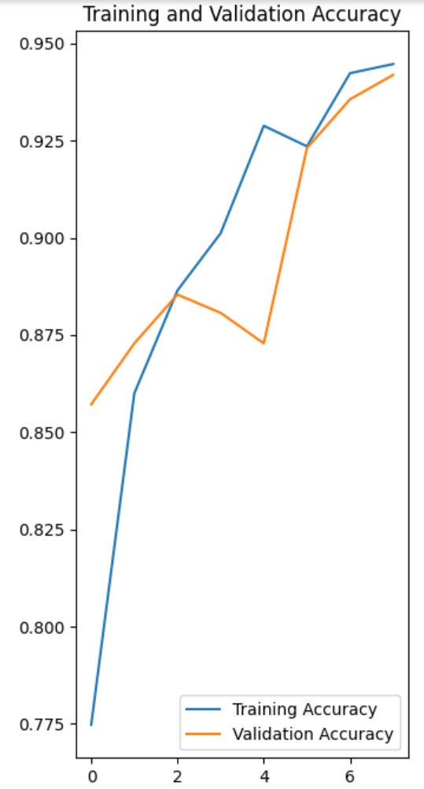       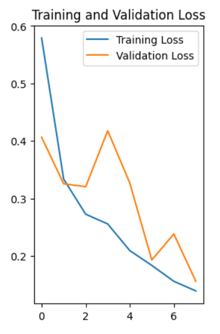

### Testing 
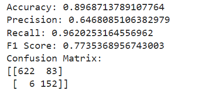

## Observations in Approach 2
1. Since this is a medical image dataset, it is impossible for me to check the authenticity of the images synthesized by SMOTE. But it does not make sense to implementing in the pipeline without being certain about the relevance of the generated images. 
2. Hence, as a counter-step, I implemented another pipeline (Approach 3) which does not involve using SMOTE, but only augmenting the raw data.
3. But augmenting minority samples when the dataset is highly disproportionate might lead to overfitting. To avoid this, I first undersampled the majority class images to 1200 (after test set division), with the minority samples being 896. 
4. From here, I implemented the same ML pipeline steps to compare the performance of the model in this scenario.

# Results of Approach 3
### Accuracy and Loss
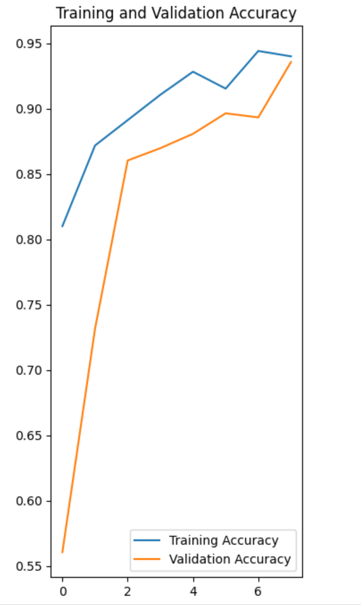       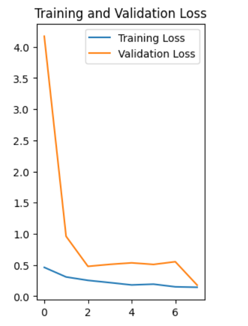

### Testing 
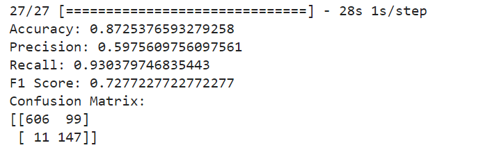

## Observations in Approach 3
1. The training and validation accuracies and loss seem to converge well without any major signs of overfitting
2. The accuracies seem decent, including the results after testing. However, the precision score has fallen to 59%. This raises a concern because the model might have generalized the minority samples too much than expected. The reason for this speculation is because the minority samples were oversampled only using Augmentation technique, which might lead to producing more similar images. 
3. Moreover, undersampling to this extent leads to a risk of losing valuable data samples from the majority class. Hence, handling this tradeoff is important.

# Conclusion
After addressing the issues in the initial approach, the second approach seems to generalize the unseen data decently, which is a good point. Additionally, the overall recall score and accuracy is has not fallen too low, this question the effectiveness of the SMOTE technique in this pipeline. But since the second approach gave a balanced predictions of both the class images, I am more confident in proposing this approach.

# Approach 1,2,3 flow
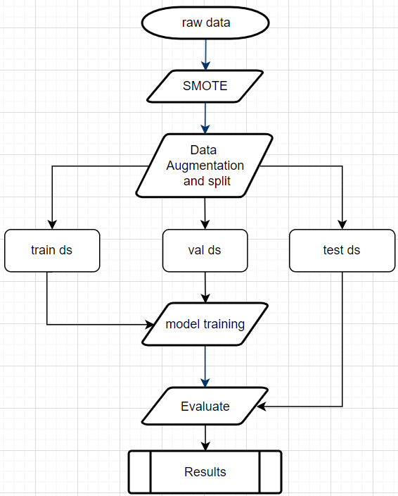       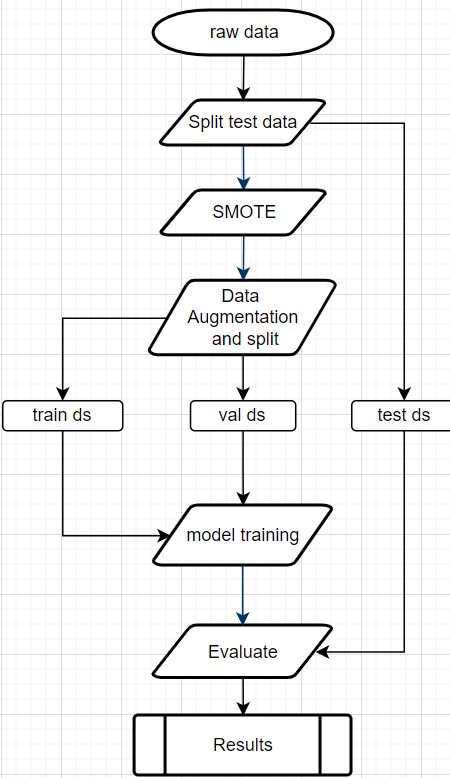  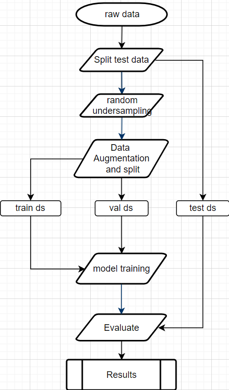

# Get the Trained Model
The trained model file is shared through this link - https://drive.google.com/file/d/1osZv0nSVaaZDnZ4eDRCe3zNVf0g2QQvo/view?usp=sharing

# Instructions to Run the Code 
## To use the model to directly predict on your dataset, run the evaluation.py using the command below:

Replace the model path value with the location of your downloaded model

python3 evaluation.py --test [path to csv file]

## To execute the data preprocessing pipeline

1. Run data_augmentation.ipynb notebook and follow the instructions to generate a test dataset and oversampled dataset

## To Train on a custom dataset 

1. Run train_model.ipynb notebook to train a Resnet50 modelon the dataset and run predictions on the test dataset.
2. If you do not have yout own train and test splits or have an imbalanced dataset, you can execute the data preprocessing pipeling to get a more balanced dataset and a test dataset.

## Google Colab Setup

If running on Google Colab, ensure you have the dataset uploaded and adjust the file paths accordingly in the notebooks provided.

# References

[National Library of Medicine Survey on CNNs in Medical Image Understanding](https://www.ncbi.nlm.nih.gov/pmc/articles/PMC7778711/)
[Keras Applications](https://keras.io/api/applications/#usage-examples-for-image-classification-models)
[State of the Art models - Paperswithcode](https://paperswithcode.com/sota/image-classification-on-imagenet)
[Transfer Learning](https://builtin.com/data-science/transfer-learning)
[how-to-organize-deep-learning-projects-best-practices](https://neptune.ai/blog/how-to-organize-deep-learning-projects-best-practices)
[Tensorflow Resnet50](https://www.tensorflow.org/api_docs/python/tf/keras/applications/ResNet50)
